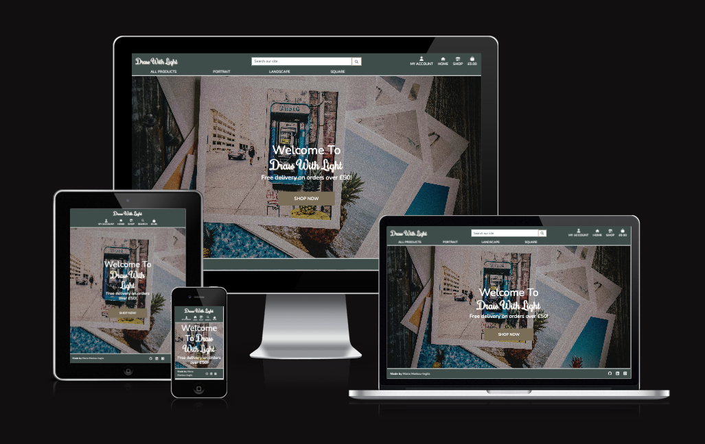
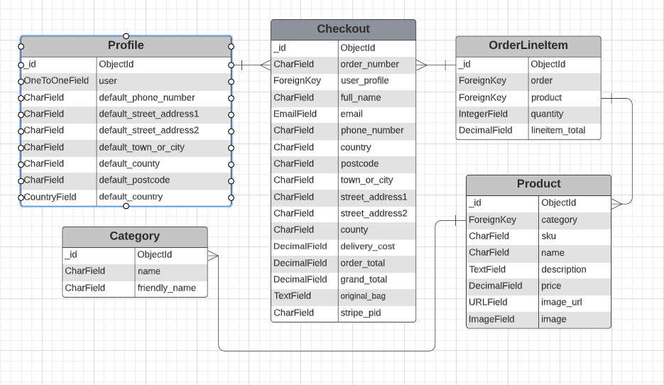
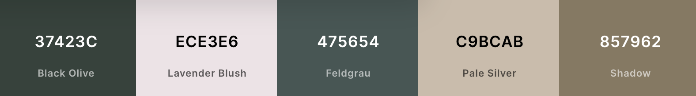
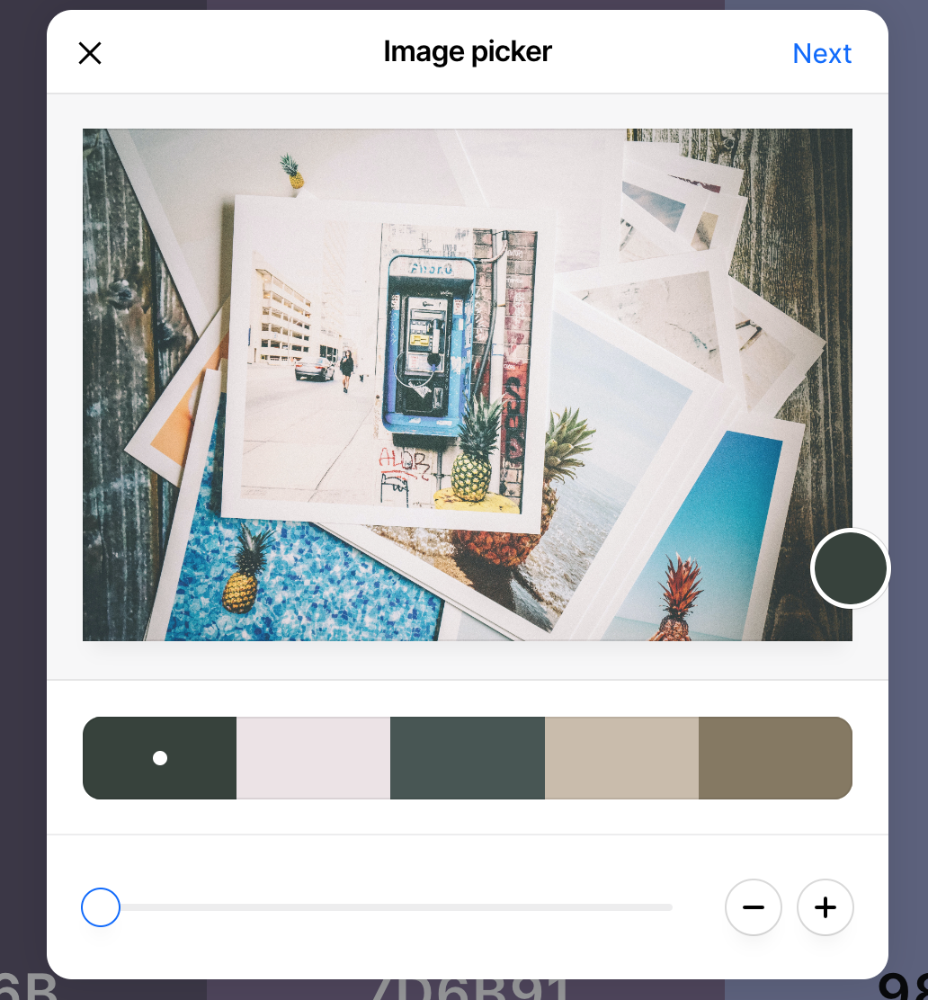

# [Draw with light](https://draw-with-light.herokuapp.com)

Draw with Light is a Full-Stack e-commerce website built using Django, Python, HTML, CSS and JavaScript. The website utilises Stripe as the payment processor.

You can find the deployed link [here](https://draw-with-light.herokuapp.com)

This site is for training purposes only, the company is fictional and no orders will be charged or products delivered

---

## Table of contents

- [Draw with light](#draw-with-light)
  - [Table of contents](#table-of-contents)
  - [UX Design](#ux-design)
    - [Project Goals](#project-goals)
    - [User Stories](#user-stories)
    - [Wireframes](#wireframes)
    - [Database schema](#database-schema)
    - [Style and colours](#style-and-colours)
  - [Features](#features)
    - [Each page of the site shares the following:](#each-page-of-the-site-shares-the-following)
    - [Future Implementations](#future-implementations)
  - [Technologies Used](#technologies-used)
  - [Testing](#testing)
  - [Deployment](#deployment)
  - [Credits](#credits)
    - [Content](#content)
    - [Acknowledgements](#acknowledgements)

---

## UX Design

  ---
  ### Project Goals
  Draw with Light is a Business to Customer (B2C) e-commerce site.
  The owner's goal is to create a website where they can sell prints of the photographs they have taken and generate income. 
  The target audience is people who love photography and want to decorate their house with it. Customers have the option to buy printed photographs which they can frame and hang on their walls.

  ### User Stories
  - #### VIEWING & NAVIGATION
      | User Story Id 	| As a    	| I want to be able to...         	| So that I can...                                                                     	|
      |---------------	|---------	|---------------------------------	|--------------------------------------------------------------------------------------	|
      | 1             	| Shopper 	| Easily navigate the site        	| Find products and information that I require                                         	|
      | 2             	| Shopper 	| View products by category       	| Find specific items I am interested in without having to scroll through all products 	|
      | 3             	| Shopper 	| View details of each product    	| Learn more about each product                                                        	|
      | 4             	| Shopper 	| View the items I have in my bag 	| Check whether I still wish to purchase the items and amend the quantity if required  	|

    - #### REGISTRATION & USER ACCOUNTS
        | User Story ID 	| As a    	| I want to be able to ...                    	| So that I can...                                        	|
        |---------------	|---------	|---------------------------------------------	|---------------------------------------------------------	|
        | 1             	| Shopper 	| Register an account                         	| Have an account with the site and view my profile       	|
        | 2             	| Shopper 	| Receive an email to confirm my registration 	| Verify my account was created successfully              	|
        | 3             	| Shopper 	| Log in and out                              	| Keep my account information secure                      	|
        | 4             	| Shopper 	| View a profile page                         	| Set a default delivery address and view previous orders 	|
        | 5             	| Shopper 	| Reset my password                           	| Recover my account                                      	|

    - #### SORTING AND SEARCHING
        | User Story ID 	| As a    	| I want to be able to...                     	| So that I can...                             	|
        |---------------	|---------	|---------------------------------------------	|----------------------------------------------	|
        | 1             	| Shopper 	| Search for a product by name or description 	| Find a specific product I'd like to purchase 	|
        | 2             	| Shopper 	| Find products from a specific category      	| Only see product from that category          	|

    - #### PURCHASING & CHECKOUT
        | User Story ID 	| As a    	| I want to be able to...                                    	| So that I can...                                                                        	|
        |---------------	|---------	|------------------------------------------------------------	|-----------------------------------------------------------------------------------------	|
        | 1             	| Shopper 	| Easily select the quantity of a product when purchasing it 	| Ensure I don't accidentally select the wrong product quantity                           	|
        | 2             	| Shopper 	| View all items in my bag                                   	| Make sure I haven't accidentally added the wrong product in my bag                      	|
        | 3             	| Shopper 	| Adjust the quantity of individual items in my bag          	| Easily make changes to my purchase before checkout                                      	|
        | 4             	| Shopper 	| Easily enter my payment information                        	| Check out quickly and with no hassles                                                   	|
        | 5             	| Shopper 	| Save all address info                                      	| I don't have to enter them again on my next order                                       	|
        | 6             	| Shopper 	| View an order confirmation after checkout                  	| Make sure my order was successfully placed and double check that all detail are correct 	|
        | 7             	| Shopper 	| Save all orders on my Profile                              	| Easily access all orders anytime                                                       	|
        | 8             	| Shopper 	| Receive an email confirmation after checking out           	| Keep the confirmation of what I've purchased for my records                             	|

    - #### ADMIN & STORE MANAGEMENT
      | User Story ID 	| As a              	| I want to be able to... 	| So that I can...                         	|
      |---------------	|-------------------	|-------------------------	|------------------------------------------	|
      | 1             	| Store Owner/Admin 	| Add a product           	| Add new items to my store                	|
      | 2             	| Store Owner/Admin 	| Edit a product          	| Update product details                   	|
      | 3             	| Store Owner/Admin 	| Delete a product        	| Remove items that are no longer for sale 	|
  [Back to top](#Table-of-contents)

  ---

  ### Wireframes
  - [Home Page](wireframes/wireframe_home.png)
  - [Products](wireframes/wireframe_products.png) 

  [Back to top](#Table-of-contents)

  ---

  ### Database schema
  
  The site uses five models as shone above:
  - User 
  - Order 
  - Order Line Item
  - Product 
  - Category

  [Back to top](#Table-of-contents)

  ---

  ### Style and colours

After creating the wireframes and main structure of the home page, I needed some inspiration for the style and colour. I sourced an [image](https://www.pexels.com/photo/pile-of-assorted-photos-191429/) that I could use as the background image for the home page. Then I headed to [coolors.co](https://coolors.co/) and use the "create palette from photo" function. I uploaded the image and played around to find a palette I liked.

I ended up only using the green colours with white to create contrast and make all text easy to read.

[Back to top](#Table-of-contents)

---

## Features
  ### Each page of the site shares the following:
    -  **Favicon**
      I used [Favivon.io](https://favicon.io/) to create the favicon for the site. I have used the initials of the site to create the favicon and the same font and colours from the site.
        
        
    -  **Navigation Bar**
        The navigation bar changed based on the size of the screen used.
        
        

    -  **Footer**  

  [Back to top](#Table-of-contents)

  ---

  ### Future Implementations
  - #### In future implementations I would like to:
    - **Add Wishlist functionality**: Allow users to save all their favorite prints so that it is easier to find them when they revisit the website.
    - **Add user reviews**: Allow users to review products and share photos of how the used the print to decorate their space.
    - **Send newsletters to users**: Give all users the option to sign up to the newsletter and keep them updated on the latest offers.
    - **Allow coupons to be accepted in the checkout**: This is a way to increase sales by offering discounted price to customers. For example offering a discount to a registered user that has not placed any orders to motivate them or reward a repeated customer.
    - **Subscription**: Give users the option to subscribe, paying a monthly fee and getting a free print every month.
    - **Implement Social login/register**: Give users the option to register and login using their social accounts.

[Back to top](#Table-of-contents)

---

## Technologies Used
- Languages Used
  - [HTML](https://en.wikipedia.org/wiki/HTML) 
  - [CSS](https://en.wikipedia.org/wiki/CSS) 
  - [Javascript](https://www.javascript.com/) 
- Frameworks Used
  - [Django](https://www.djangoproject.com/) - used to simplify development   
  - [Bootsrap](https://getbootstrap.com/) - used for styling and responsiveness 
- Database Used
  - [sqlite3](https://docs.python.org/3/library/sqlite3.html) - used for development
  - [ElephantSQL](https://www.elephantsql.com/) - used for deployment
- Libraries & Packages Used
  - [Django-Allauth](https://django-allauth.readthedocs.io/en/latest/installation.html) -  used to simplify user authentication, registration, account management
  - [Font Awesome](https://fontawesome.com/) - used for all the icons on the site
  - [django-countries](https://pypi.org/project/django-countries/) - dropdown list of countries used on checkout
  - [django_crispy_forms](https://pypi.org/project/django-crispy-forms/) - provides a tag and filter that lets you quickly render forms
  - [gunicorn](https://pypi.org/project/gunicorn/) - a Python WSGI HTTP Server
  - [pillow](https://pypi.org/project/Pillow/) - Python imaging library
  - [dj_databsae_url](https://pypi.org/project/dj-database-url/) - allows us to utilise the DATABASE_URL variable
  - [psycopg2](https://pypi.org/project/psycopg2/) - a postgres database adapter which allow us to connect with a postgres database
  - [django-storages](https://pypi.org/project/django-storages/) - a storage backend library
  - [boto3](https://pypi.org/project/boto3/) - Allows connection to AWS S3 bucket
- Stripe
  - [Stripe](https://stripe.com/gb) was used in the project to implement the payment system
- Programs Used
  - [Favicon](https://favicon.io/) used to create the favicon
  - [Git](https://git-scm.com/) - used for version control.
  - [GitHub](https://github.com/) - used o save and store the files for this project.
  - [Google Dev Tools](https://developer.chrome.com/docs/devtools/) - used to troubleshoot, test features and solve issues with responsiveness and styling.
  - [Lucidchart](https://lucid.app/) - used to create the database schema

[Back to top](#Table-of-contents)

---

## Testing
  Find more [here](TESTING.md)

---

## Deployment

[Back to top](#Table-of-contents)

---

## Credits
- ### Code
  - Boutique Ado walk-through project from [Code Institute](https://codeinstitute.net/)
  - [Bootstrap Docs](https://getbootstrap.com/docs/5.0/getting-started/introduction/)
  - [Django-Allauth Documentation](https://django-allauth.readthedocs.io/en/latest/installation.html)

### Content
- Hero Image By [Pineapple Supply Co](https://www.pexels.com/photo/pile-of-assorted-photos-191429/)
- Product Photos: I have taken all the photos on the website. You can find some of them on my [Instagram](https://www.instagram.com/mkp.maria/)

### Acknowledgements

[Back to top](#Table-of-contents)