# Testing

## Table of contents

- [Testing](#testing)
  - [Table of contents](#table-of-contents)
  - [Code Validation](#code-validation)
    - [HTML](#html)
    - [CSS](#css)
    - [JS](#js)
    - [Python](#python)
  - [Automated Testing](#automated-testing)
  - [Manual Testing](#manual-testing)
    - [Testing User Stories](#testing-user-stories)
    - [Devices used for testing:](#devices-used-for-testing)
    - [Browsers Used for Testing](#browsers-used-for-testing)
    - [Google Lighthouse](#google-lighthouse)
  - [Bugs](#bugs)
    - [Solved](#solved)
    - [Known Bugs](#known-bugs)
## Code Validation
  ### HTML
  All templates were validated using W3C
  - Home Page
  
  - Bag
  
  - Checkout
    
  - Checkout Success
    
  - Products
    
  - Product Details
    
  - Add Products
    
  - Edit Products
    

  ### CSS
  - base.css
  
  - profile.css
  
  - checkout.css
  

  ### JS
  - stripe_elements.js
    
    Warning for line 34 and 98 were ignored. I added the missing semicolon and tested again.
      

  ### Python
  Validated using [Code Institute Python Linter](https://pep8ci.herokuapp.com/)
  - **draw_with_light app**
    - setting.py
      - Results: 
        - `145: E501 line too long (91 > 79 characters)`
          `148: E501 line too long (81 > 79 characters)`
          `151: E501 line too long (82 > 79 characters)`
          `154: E501 line too long (83 > 79 characters) `
    - urls.py
      - Results: All clear, no errors found 
- **bag app**
  - apps.py
    - Results: All clear, no errors found 
  - bag-tool.py
    - Results:  All clear, no errors found 
  - context.py
    - Results:  All clear, no errors found 
  - urls.py
    - Results: All clear, no errors found
  - views.py
    - Results: All clear, no errors found
- **checkout app**
  - admin.py
    - Results: All clear, no errors found
  - apps.py
    - Results: All clear, no errors found
  - forms.py
    - Results: All clear, no errors found
  - models.py
    - Results: All clear, no errors found
  - signals.py
    - Results: All clear, no errors found
  - urls.py
    - Results: All clear, no errors found
  - views.py
    - Results: All clear, no errors found
  - webhook_handler.py
    - Results: All clear, no errors found
  - webhooks.py
    - Results: All clear, no errors found
- **home app**
  - apps.py
    - Results: All clear, no errors found
  - urls.py
    - Results: All clear, no errors found
  - views.py
    - Results: All clear, no errors found
- **products app**
  - admin.py
    - Results: All clear, no errors found
  - apps.py
    - Results: All clear, no errors found
  - forms.py
    - Results: All clear, no errors found
  - models.py
    - Results: All clear, no errors found
  - urls.py
    - Results: All clear, no errors found
  - views.py
    - Results: All clear, no errors found
- **profiles app**
  - apps.py
    - Results: All clear, no errors found
  - forms.py
    - Results: All clear, no errors found
  - models.py
    - Results: All clear, no errors found
  - urls.py
    - Results: All clear, no errors found
  - views.py
    - Results: All clear, no errors found

All `E501 line too long` results were fixed

[Back to top](#Table-of-contents)

--- 

## Automated Testing
In this project their are 3 instances of automated testing. I would like to note that if given more time i would have liked to have expanded on this, however the deadline was extremely tight.
The apps that i have tested are:
  - Home Page
   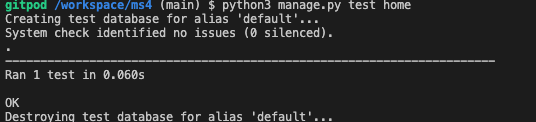
  - Bag
   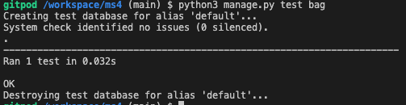
  - Products
   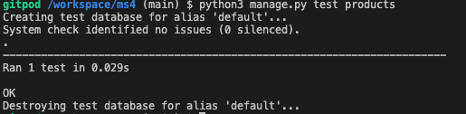
These tests are all in a separate file called test_views.py within the relevant app folders, and have been written using Python.

[Back to top](#Table-of-contents)

---

## Manual Testing
### Testing User Stories
  - #### VIEWING & NAVIGATION
  1.  **As a Shopper 	I want to  easily navigate the site so that I can find products and information that I require** 	
    A navbar is provided at the top of the page which allows all users to easily access their account, home page, shop, search bar and bag. The navigation bar is different depending on the size of the screen used
      
      
  1. **As a Shopper I want to view products by category so that I can find specific items I am interested in without having to scroll through all products**
     On bigger screens users can find a row with where there is a button for each category (Portrait, Landscape, Square), and a button for all products.
    hop icon located on the navbar
    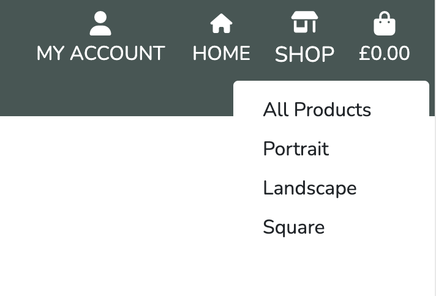
    On smaller screens users can find all categories by clicking on the shop icon only. 
  2. **As a shopper I want to view details of each product so that I can learn more about each product**	
    When a user selects a product, they will be taken to the product detail page which lists more information about the item, such as the item name, price and description. Users can also click on the product image to view a larger version.
  3. **As a shopper I want to view the items I have in my bag so that I can check whether I still wish to purchase the items and amend the quantity if required** 	
      Users can find all products  currently selected for purchase, along with the quantity, item price and subtotal for that item. At the bottom of their bag there is a section that lets them know the total for the items in their bag, the delivery charge (where applicable) and their grand total. Users can update quantity or remove an item using the buttons ot that page.
      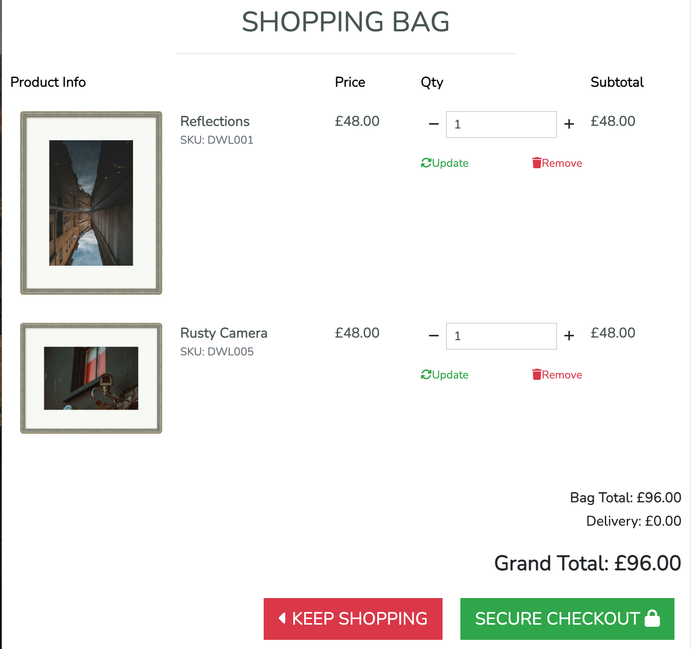
  - #### REGISTRATION & USER ACCOUNTS
    1. **As a shopper	I want to be able to register an account so that I have an account with the site and view my profile**
    Users can register for an account via the account icon in the navbar, which is available on all pages of the site. If a user doesn't have an account during checkout, they are given an option to create an account on the checkout page
    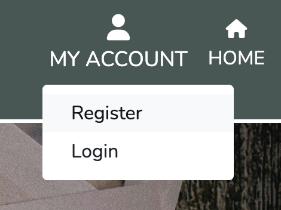
    2. **As a shopper I want to be able to receive an email to confirm my registration so that I can verify my account was created successfully**
    As soon as a user fills in the registration form the are directed to the confirmation-email page and they receive an email with a link asking them to confirm their account
    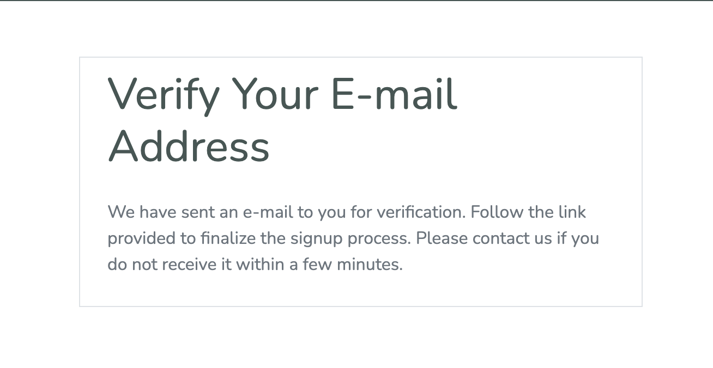
    3. **As a shopper I want to be able to log in and out so that I can	keep my account information secure**
    When a user clicks on the account icon on the navigation bar, they have two options, register and log in.
    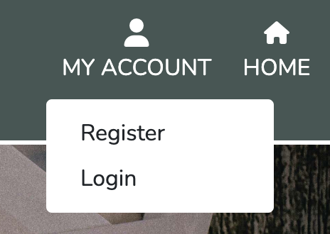
    When a user clicks the login option, they are taken to the sign in form where they can fill in their info and sign in
    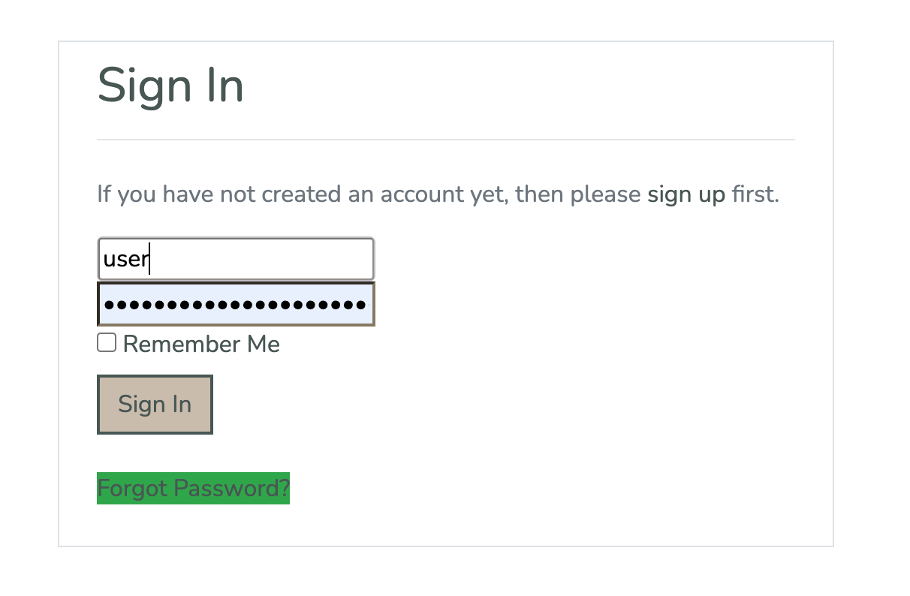
    4. **As a shopper I want to be able to view my profile page so that I can set a default delivery address and view previous orders**
    Users are able to view their profile page once logged in via the account icon on the navbar which is accessible on all pages of the site. Their profile allows them to select their default delivery information (if filled out will pre-populate the checkout page if the user is signed in). Users are also able to view their previous orders within their profile.
    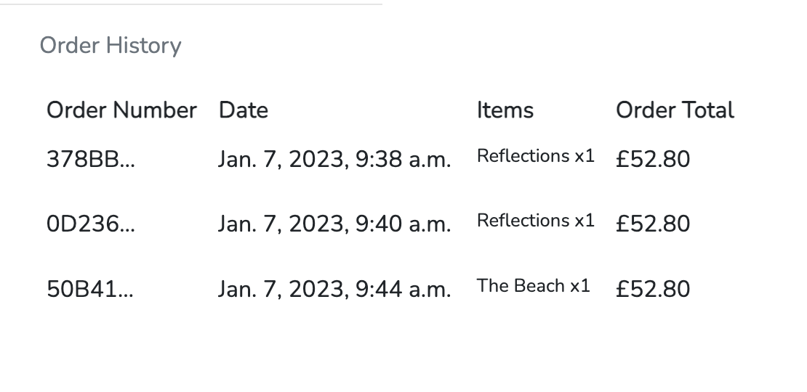
    When a users clicks on the order number it takes them to a different page where they can see all the order details
    5. **As a shopper I want to be able to reset my password so that I can recover my account**
    If a user has forgotten their password, they can click on the forgotten password button during login to reset their password
    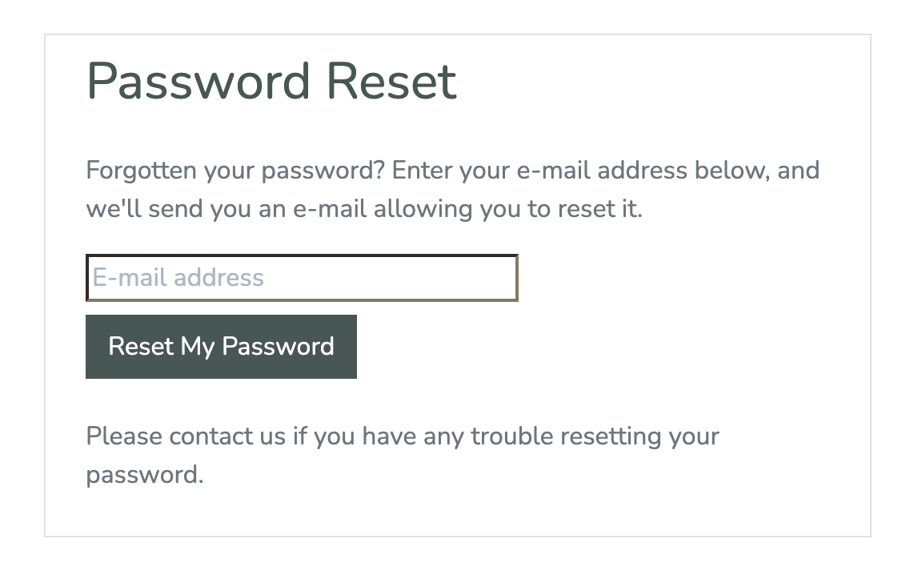
  - #### SORTING AND SEARCHING
  1. **As a shopper I want to be able to search for a product by name or description	so that I can find a specific product I'd like to purchase**
  Users are provided with a search bar in the navbar which allows them to search for specific products. The search function check product names and description.
  2. **As a shopper I want to be able to find products from a specific category	so that I can only see products from that category**
  Users viewing the website from smaller screens can find all product categories by clicking on the shop dropdown icon on the navigation bar. Users on bigger screen can find a second row on the navigation bar with a button for each category
  
  
  - #### PURCHASING & CHECKOUT
  1. **As as shopper I want to be able to easily select the quantity of a product when purchasing it	so that I can ensure I don't accidentally select the wrong quantity**
  Users can easily adjust and select the quantity they need by clicking on the - & + symbols on the product-details page, before adding the product in their bag.
  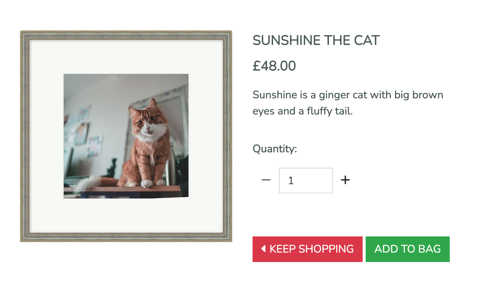
  2. **As as shopper I want to be able to	view all items in my bag	so that I can make sure I haven't accidentally added the wrong product in my bag**
   When a user views their bag, they will be presented with a list of all items selected for purchase, information shown will include an image of the item, the items name, the quantity of the item selected, the unit price of the item and the subtotal price for that item. At the bottom of the bag the user will be given the subtotal for all the items they are purchasing, the delivery fee (when applicable) and the grand total of their order.
   
  3. **As as shopper I want to be able to adjust the quantity of individual items in my bag so that I can	easily make changes to my purchase before checkout**
  Users are given a quantity selector on the bag page that looks the same as on the product detail page to provide continuity and familiarity. Once the user has selected the new quantity, they click the update link under the quantity input and the page will reload and prices will update.
  If a user decides they would like to remove the item completely from their bag they do so by clicking the remove link under the product. This shows a toast which confirms that the user has successfully deleted the selected item from their bag. 
  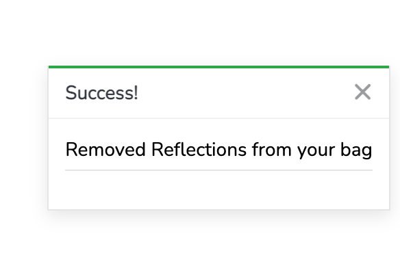
  4. **As as shopper I want to be able to easily enter my payment information so that	I can check out quickly and with no hassles**
  When a user is taken to the checkout page they can clearly see 3 sections of information that need to be completed to complete their order - their details, the delivery information and the payment information. Feedback is provided to the user whilst completing the checkout if any information they give is invalid.
  5.  **As as shopper I want to be able to save all address info so that I don't have to enter them again on my next order**
  If a user is logged in and on the checkout page, they have the option to save their delivery info by leaving the the "Save this delivery information to my profile" ticked. They also have the option to go to their profile page and fill in the info there
  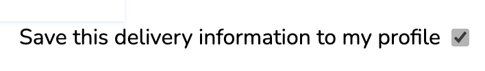
  6. **As as shopper I want to be able to view an order confirmation after checkout so that I can	make sure my order was successfully placed and double check that all detail are correct**
  When an order is successfully placed and payment taken, users are taken to an order confirmation page which provides them with their order information. They are also shown their order details which lists the items they have purchased along with their quantity and the price of each item. A delivery section provides them with information on where they are having their order delivered to and finally they are shown the billing information section which provides them with their total, the delivery fee (where applicable) and the grand total for their order.
  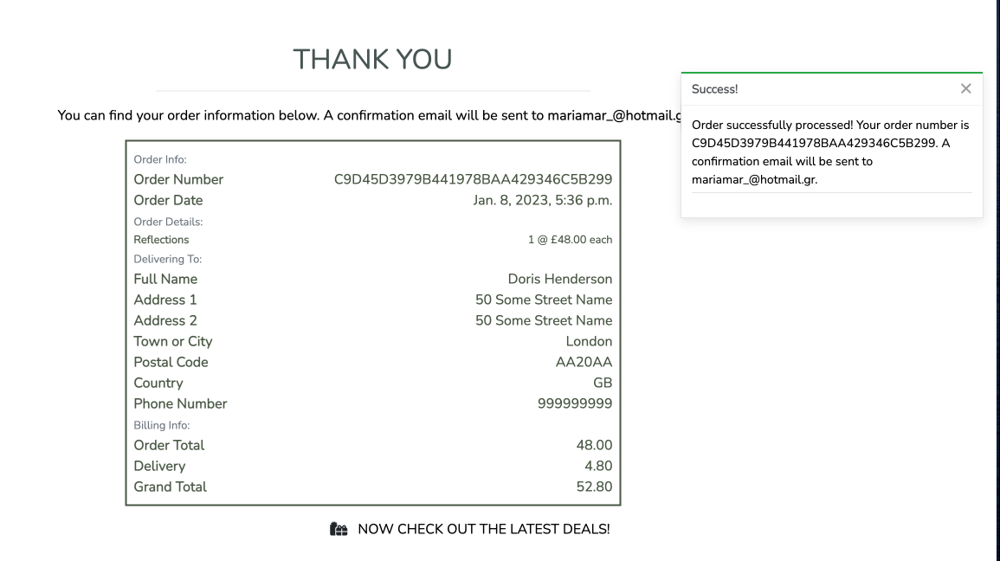
  7. **As as shopper I want to be able to save all orders on my Profile	so that I can easily access all orders anytime**
  When an order is placed, users profile is updated. All they have to do it load up their profile and they can see all the orders they have placed.
  
  8. **As as shopper I want to be able to receive an email confirmation after checking out so that I can Keep the confirmation of what I've purchased for my records**
  Upon successful checkout, a user will be sent a confirmation email
  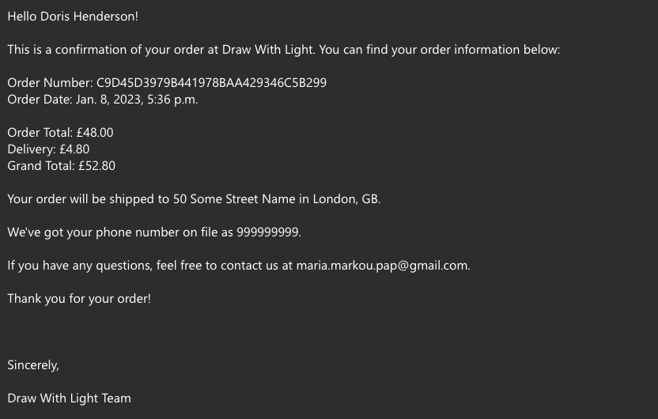
  - #### ADMIN & STORE MANAGEMENT
   1. **As an admin I want to be able to add a product so that I can add new items to my store**
   When an admin is logged in (superuser account), they can find a product management option once they click on their account icon located on the navigation bar. This option will take them to the add product page where they can fill in the form and add a new product which will automatically be displayed on the product page.
  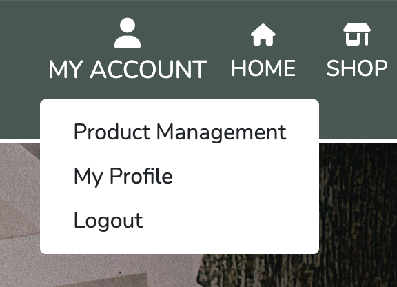
   2. **As an admin I want to be able to edit a product so that I can update product details**
    When a superuser is logged in, they are shown an edit button underneath each product on the products page. The same edit button is also shown on the product detail page. Once clicked they will be taken to a page similar to the add product page and where they will be able to edit the product information
    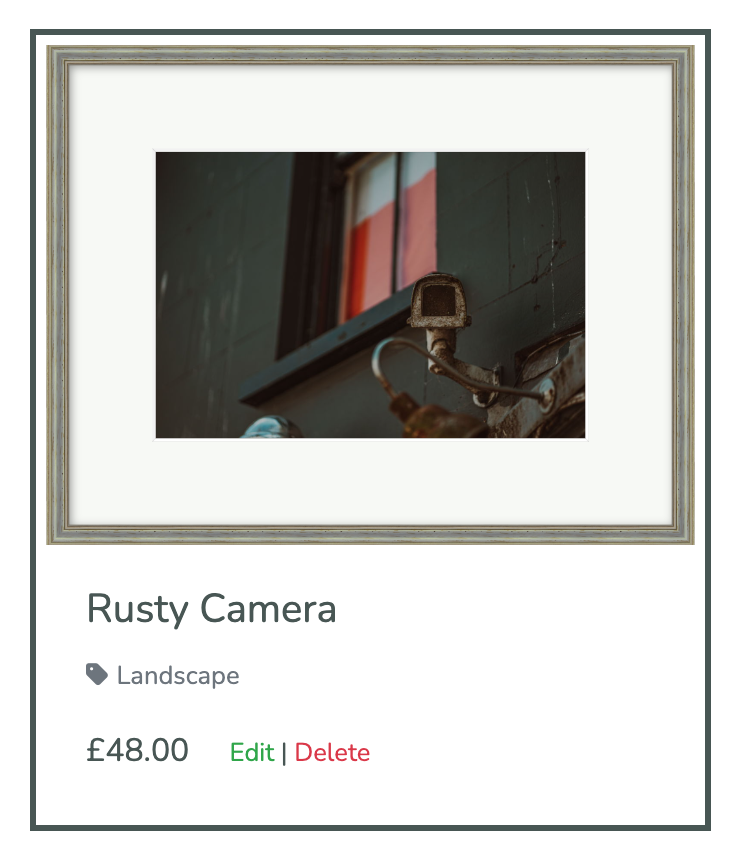
    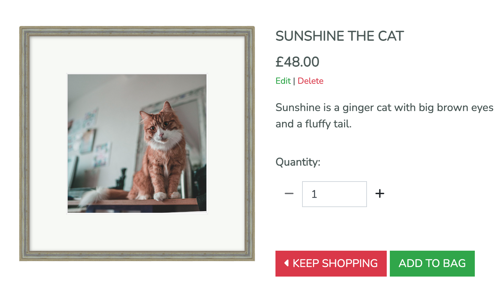
  3. **As an admin I want to be able to delete a product so that I can remove items that are no longer for sale**
   When a superuser is logged in, they are shown an edit delete button underneath each product on the products page. The same delete button is also shown on the product detail page. Once the admin clicks the button the product is     automatically deleted
### Devices used for testing:
- MacBook Pro 15' - Desktop
- Xiaomi Redmi Note 10 - Mobile
- From DevTools the following preset dimensions:
  - iPhone SE
  - iPhone XR
  - iPhone Pro 12
  - Samsung Galaxy S8+
  - iPad Air
  - iPad Mini
  - Surface Pro 7
  - Nest Hub
  - Nest Hub Max 
### Browsers Used for Testing
- Google Chrome
- Monzila FireFox
- Safari 
No issues found

### Google Lighthouse 
- Home Page 
  Home page was checked using [Lighthouse](https://chrome.google.com/webstore/detail/lighthouse/blipmdconlkpinefehnmjammfjpmpbjk?hl=en). The following issue was found on the navigation bar which was affecting SEO. I wanted to fix it but run out of time.
  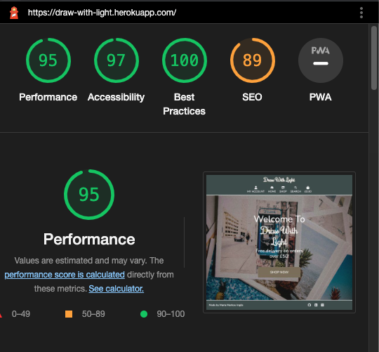
  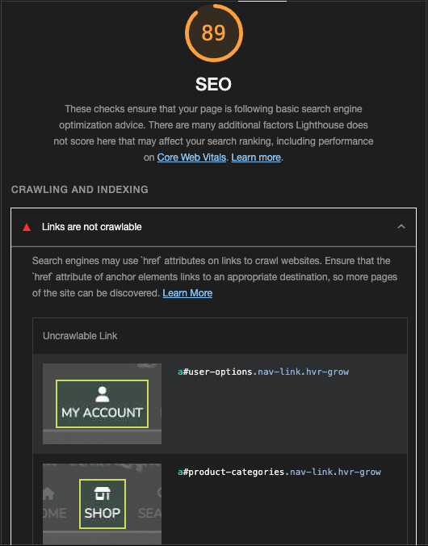
[Back to top](#Table-of-contents)

---


## Bugs
### Solved
  - #### Stipe Webhook Response Error 
    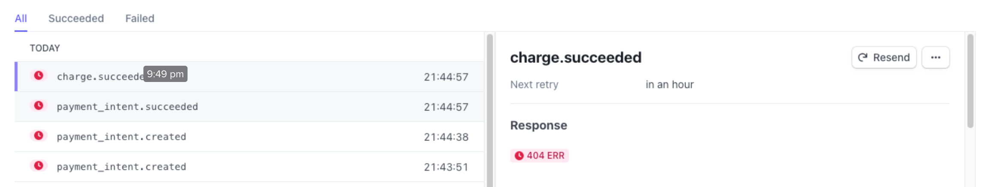
    After successfully placing an order, I was getting a 404 response on stripe which meant that the endpoint webhook wasn't found. I found out that it was caused by Gitpod changing the server number of my workspace from eu-80 to eu-81. I updated the endpoint on Stripe and placed another order to test it.
    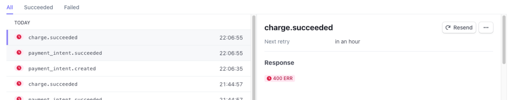
    After updating the endpoint I was getting a 400 error. I added some print statements on the webhook file will which raised the following error:
    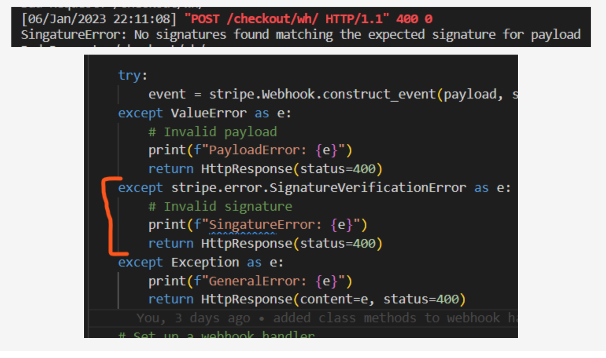
    Stripe's Webhook Secret Key wasn't coming through which was causing the problem. That was happening because when I added the Webhook Secret on Heroku's Vars I forgot to added on my env file. When I added the Webhook Secret on the env file I also found that I forgot to add 'DEVELOPMENT' on that file as well. After updating both I placed another order to test it and checked on stipe's webhook logs.
    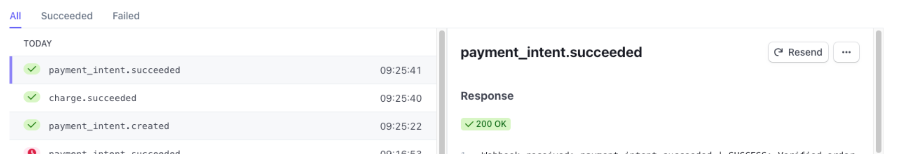
    I was getting a 200-OK Response. I committed the changes and tested the deployed app on Heroku as well. After placing an order on the deployed app, I was getting and error again which was caused by a missing trailing slash in the endpoint.
     
    I edited the endpoint on stripe, placed and other order and tested it again.
     
  [Back to top](#Table-of-contents)


    To resolve the issue I have taken the following steps:
    - I checked that the bucket policy had public access.
    - I checked the bucket policy code written in JSON for syntax mistakes.
    - I checked that the AWS Access Key ID and AWS Secret Access Key from where correctly added on Heroku's Config Vars.

    When checking the AWS Access Key ID I noticed that there was a '/' in it which can be problematic. I tried generating a new Access Key ID from AWS and updating it on Heroku's Config Vars which solved the issue.
    
    ---
  - #### Connecting Django to AWS
    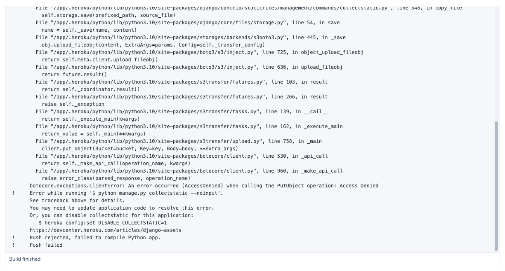

    I deployed the app on Heroku but without the static files. I created a S3 Bucket on AWS to store the static files and linked that to my app. After linking AWS to my app and trying to redeploy on Heroku I was getting the following error:
    
    ```
     botocore.exceptions.ClientError: An error occurred (AccessDenied) when calling the PutObject operation: Access Denied
     Error while running '$ python manage.py collectstatic --noinput'. 
    ```

    To resolve the issue I have taken the following steps:
      - I checked that the bucket policy had public access.
      - I checked the bucket policy code written in JSON for syntax mistakes.
      - I checked that the AWS Access Key ID and AWS Secret Access Key from where correctly added on Heroku's Config Vars.

    When checking the AWS Access Key ID I noticed that there was a '/' in it which can be problematic. I tried generating a new Access Key ID from AWS and updating it on Heroku's Config Vars which solved the issue.

  - #### The jQuery was not working for the toasts
 I researched this issue on slack and it seemed to be a known error with the toasts and bootstrap 5. As I was on a very tight deadline for this project and could not find a solution over an afternoon, despite bootstrap 5 being compatible for use with jQuery, I have decided to revert the bootstrap version used in the project down to 4.4.1. This also meant that I had to update some of the css
 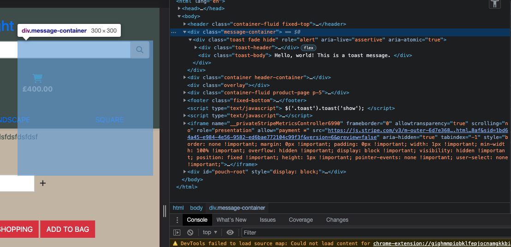
 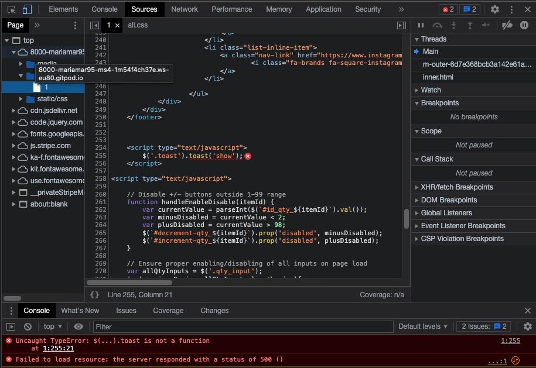

### Known Bugs
- #### County Input Field
- Both on Profile and Checkout Page, the country input field is longer that the rest of the input fields. I wanted to customise the input forms and add some space around the input fields but I run out of time.
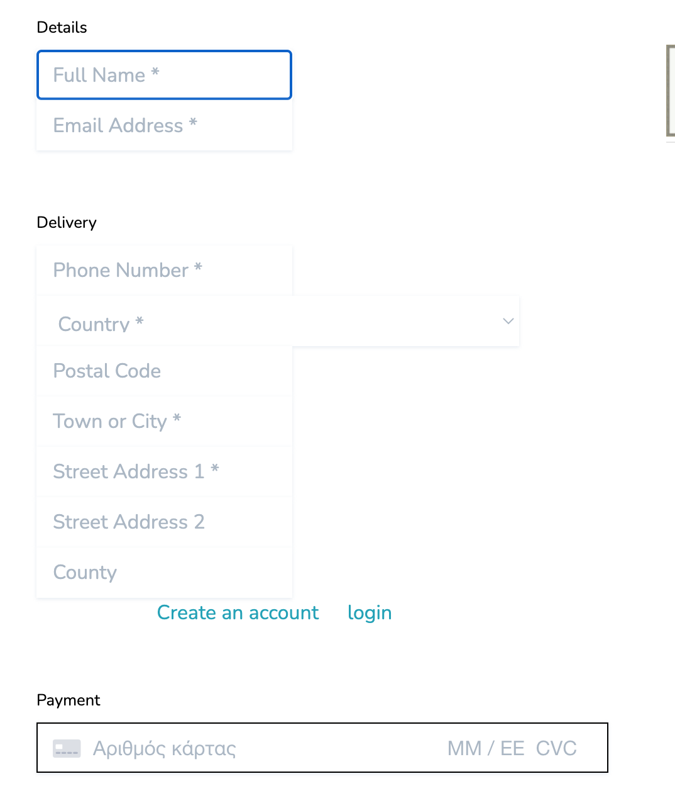